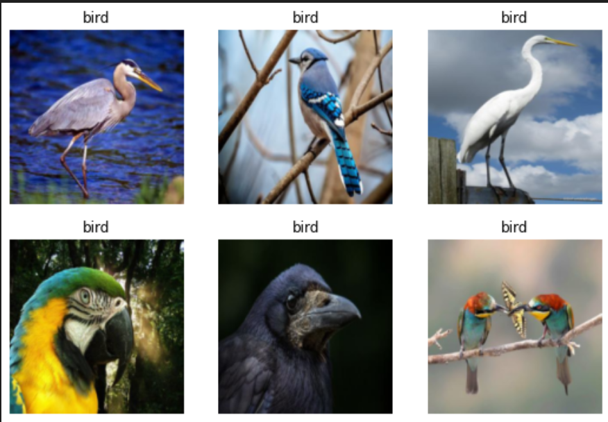
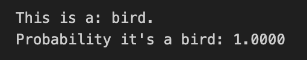
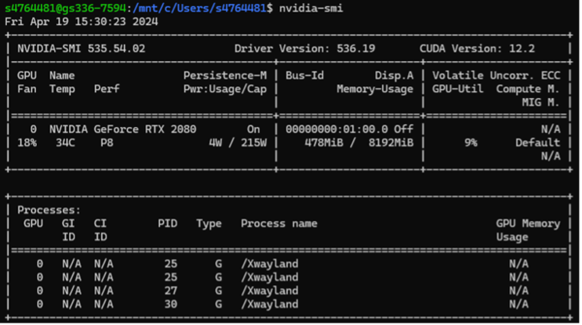
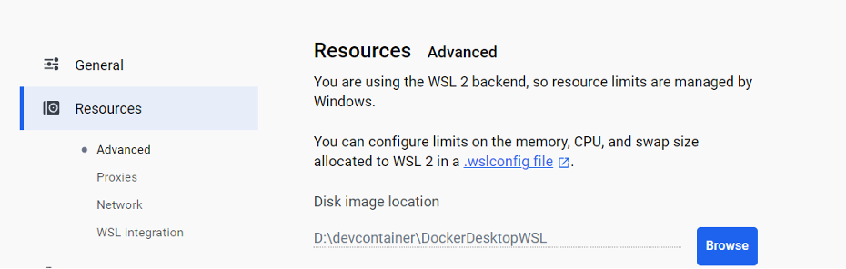

# Feedbacks about FastAI

In this assignment, we focus on using FastAI to tackle image recognition problems. We will employ tools such as DuckDuckGo, FastAI, FastDownload, and PIL to gather image data and train neural network models. 

The FastAI course is practice-oriented, encouraging students to deepen their understanding of deep learning through hands-on practice. These courses usually cover the entire process from data preprocessing to model training, evaluation, and deployment. Additionally, the FastAI community is active and provides a wealth of support, offering numerous resources and assistance to learners such as fastai ([https://course.fast.ai/](https://course.fast.ai/)). With FastAI, we can not only learn the latest deep learning technologies but also acquire the ability to apply these technologies to solve real-world problems.

## Is it a bird or not

This course was quite novel to me. I originally thought that to train a neural network capable of recognizing images, one would need to build a database locally and then manually construct neural networks such as CNNs, train, and test them. This process would require writing a lot of code, with even more time spent debugging them. However, the FastAI library has incorporated APIs for various complex neural networks, and we only need to call the API that suits our needs. For me, more time has shifted towards researching how to use these libraries. Indeed, engineers spend most of their time “Google-Oriented Programming”.

Take the ResNet18 used in the assignment as an example. ResNet18 is a widely used convolutional neural network favored for its good performance and relatively quick training speed.

Using FastAI's DataBlock API to construct data loaders (DataLoaders) for image classification involves automating the loading, splitting, and transformation of data. In this example, the training set comprises 80% of the data, with the remaining 20% used for validation. Additionally, the default batch size is set to 64, which specifies the number of images processed by the network in each training iteration.

```python
dls = DataBlock(
    blocks=(ImageBlock, CategoryBlock),
    get_items=get_image_files,
    splitter=RandomSplitter(valid_pct=0.2, seed=42),
    get_y=parent_label,
    item_tfms=[Resize(192, method='squish')]
    ).dataloaders(path)
dls.show_batch(max_n=6)
```


FastAI facilitates image transformations such as scaling and resizing to process input images, ensuring that the model can learn from standardized inputs. Using FastAI's vision_learner, the ResNet18 network is loaded, and FastAI's fine_tune method is utilized to adjust the pretrained model to adapt to a new dataset (in this case, distinguishing between "bird" and "non-bird" images).

```python
learn = vision_learner(dls, resnet18, metrics=error_rate)
learn.fine_tune(3)
```


Fine-tuning is a process that adapts a pretrained model to a new task by making minor adjustments to the existing model weights. After training, the model's performance is evaluated using a validation set, and new images are predicted to determine their categories.

```python
is_bird,_,probs = learn.predict(PILImage.create('bird.jpg'))
print(f"This is a: {is_bird}.")
print(f"Probability it's a bird: {probs[0]:.4f}")
```



This case excellently demonstrates how tools like FastAI can be used to quickly build a practical image classification model from scratch, achieving high accuracy through the use of pretrained networks and fine-tuning. These steps and methods provide an effective blueprint for the rapid development and deployment of machine learning models.

## Challenges While completing the task

Next, I would like to discuss the difficulties I encountered while learning FastAI and the solutions.

### Docker Configuration

Since the course22 file needed to run in a Docker environment, we first had to set up the Docker environment. Fortunately, Prof. Lovell had already written a blog post on this topic, which allowed us to complete the configuration without spending too much time.

### GPU initialization

During the environment setup process, we needed to update our GPU, but often I would see the WDDM (Windows Display Driver Model) label, indicating that the GPU was not accessible, and the version of GPU driver in Windows is different with the version in WSL.

> Terminal in WSL


> Terminal in Windows 


Here we have two different versions of GPU. In Windows, the version is NVIDIA-SMI 536.19, yet in WSL is NVIDIA-SMI 535.54.02. I notice that the GPU driver in Ubuntu 22.04 may be different with the GPU driver in Windows, even though I am so sure that I have installed only one version's GPU driver. The driver which has a low version cannot run on Windows, but can run on Ubuntu. The driver which has a high version can run on Windows, yet not on Ubuntu.

On this assignment, Ubuntu 22.04 only support the GPU driver version lower that 537 (based on website). Once I have installed a high version of GPU and it cannot be displayed on Ubuntu, I have no choice but uninstalled the higher version and reinstalled a lower version.

### Red C disk

After fixing GPU issue, I started to run the code. The situation was good at the beginning, but suddenly my computer became very slow. It turns out that my C driver was filled, and there is no space for this project.

> Angry C disk


I asked this problem on ED for some help, and Prof. Lovell said I can change 'Image path' in Docker.

> Set image path in Docker


After setting the path, the issued was solved, but there are other problems that bother me, so I have to use the laboratory computer with a remote connection. It turns out that the computer in the laboratory is still very reliable.

### Export .ipynb to .pdf

After finishing all of the problems related to this project, I was trying to export 'ipynb' to 'pdf'. But it seems that the laboratory computer has some kind of protection that does not allow us to export files directly from WSL to the desktop, even though I have set the correct UNCHost.

Finally, it suddenly occurred to me that since the code is running in Docker, maybe the file is also can be found in docker. Following this thought, I browsed the folder in image and found the file I want.

> Files in Docker


The above is my impression of learning FastAI; it is an excellent course. Most of the content in the course, such as Docker, Linux command line, and WSL, comprises what I am eager to learn. These technologies will not only enhance my competitiveness but also allow me to be exposed to more cutting-edge related technologies and broaden my horizons.